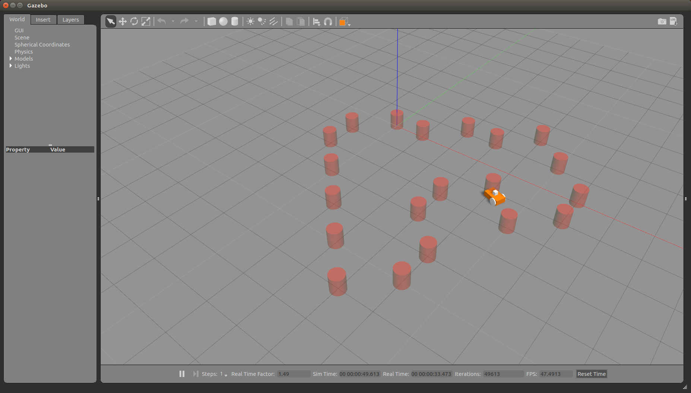

# Tutorial for ROS and Gazebo
This is the code basis for ROS and Gazebo Tutorials and Assignments. We use a simulated differential drive robot equipped with
* IMU
* Odometer
* Temperature Sensor

## Requirements
* ROS (recommended: Kinetic), Installation Instructions under http://wiki.ros.org/kinetic/Installation/Ubuntu
* Gazebo (recommended: Version 7.0), comes with the ROS full version, otherwise http://gazebosim.org/tutorials?tut=install_ubuntu&ver=7.0
* (optional) ROS-QTC-Plugin for using QT Creator as IDE (https://ros-qtc-plugin.readthedocs.io/en/latest/_source/Improve-ROS-Qt-Creator-Plugin-Developers-ONLY.html)

## How to:
* Start by creating a catkin workspace folder, downloading the git repository and compiling the code
```bash
mkdir -p ~/tutorial_ws/src
cd ~/tutorial_ws/src 
git clone https://github.com/NRottmann/ROS_Gazebo_Tutorial.git
cd  ..
catkin_make
```
* Start the simulation
```bash
cd ~/tutorial_ws
source devel/setup.bash
roslaunch simulation_environment apartment.launch
```
* The Gazebo environment should have opened and something similar to the image below should have appeared:


* Now you can move the robot around by opening a new terminal and typing
```bash
rosrun teleop_twist_keyboard teleop_twist_keyboard.py
```

## Assignments:
Here we explain shortly the Assignments and what has to be changed or added to pass the Assignments.

* Assignment 01 - Kalman Filter
In this assignment you have to modify the package localization. Here the kalman_filter.cpp has to be adjusted such that it takes the IMU data (\imu) and the odometry data (\odom) and fuses them together using a Kalman Filter and send them out as nav_msgs/Odometry (/odomKalmanFilter). Until now, the node just feeds forward the the odometry messages without taking the IMU messages into account. You can test the simulation environment with
```bash
roslaunch simulation_environment assignment01.launch
```
The resulting Gazebo environment should look like:

