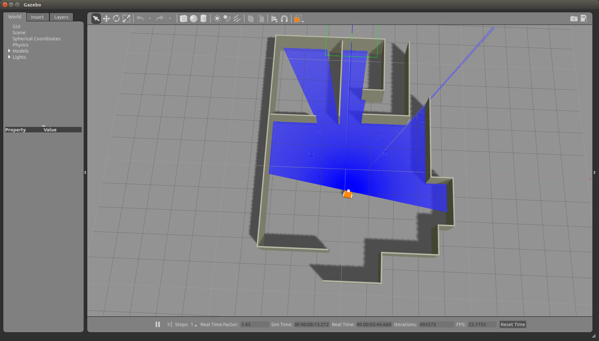

# Tutorial for ROS and Gazebo
This is the code basis for ROS and Gazebo Tutorials and Assignments. We use a simulated differential drive robot equipped with different sensors, such as an IMU, an Odometer, a LiDAR or a Camera. Check out the video tutorials for getting a detailed introduction into ROS and Gazebo.


## Table of Contents  
[Requirements](#requirements) <br/>
[Additional Required Packages](#packages) <br/>
[Get Started](#getstarted) <br/>
[Video Tutorials](#video) <br/>
[Important Topics](#topics) <br/>
[Assignment 01](#assignment01) <br/>
[Assignment 02](#assignment02) <br/>
[Performance Improvements for Virtual Machines](#improvement) <br/>
[License](#license) <br/>

## Requirements <a name="requirements"></a>
* ROS Kinetic (Ubuntu 16.04) or Melodic (Ubuntu 18.04), Installation Instructions can be found [here](http://wiki.ros.org/kinetic/Installation/Ubuntu)
* Gazebo (recommended: Version 7.0), comes with the ROS full desktop version, otherwise Installation Instructions can be found [here](http://gazebosim.org/tutorials?tut=install_ubuntu&ver=7.0)
* (optional) ROS-QTC-Plugin for using QT Creator as IDE, Installation Instructions can be found [here](https://ros-qtc-plugin.readthedocs.io/en/latest/_source/Improve-ROS-Qt-Creator-Plugin-Developers-ONLY.html)

## Additional Required Packages (installation instructions are given for ROS Melodic) <a name="packages"></a>
* [gmapping](http://wiki.ros.org/gmapping)
```bash
sudo apt-get install ros-melodic-gmapping
```
* [teleop_twist_keyboard](http://wiki.ros.org/teleop_twist_keyboard)
```bash
sudo apt-get install ros-melodic-teleop-twist-keyboard
```
* [map_server](http://wiki.ros.org/map_server)
```bash
sudo apt-get install ros-melodic-map-server
```
* [amcl](http://wiki.ros.org/amcl)
```bash
sudo apt-get install ros-melodic-amcl
```
* [move_base](http://wiki.ros.org/move_base)
```bash
sudo apt-get install ros-melodic-move-base
```
* [global_planner](http://wiki.ros.org/global_planner)
```bash
sudo apt-get install ros-melodic-global-planner
```
* [teb_local_planner](http://wiki.ros.org/teb_local_planner)
```bash
sudo apt-get install ros-melodic-teb-local-planner
```

## Get Started <a name="getstarted"></a>
* Start by creating a catkin workspace folder, downloading the git repository and compiling the code
```bash
mkdir -p ~/tutorial_ws/src
cd ~/tutorial_ws/src 
git clone https://github.com/NRottmann/ROS_Gazebo_Tutorial.git
cd  ..
catkin_make
```
* Start the simulation
```bash
cd ~/tutorial_ws
source devel/setup.bash
roslaunch simulation_environment apartment.launch
```
* The Gazebo environment should have opened and something similar to the image below should have appeared:


* Now you can move the robot around by opening a new terminal and typing
```bash
rosrun teleop_twist_keyboard teleop_twist_keyboard.py
```

## Video Tutorials <a name="video"></a>
[](http://www.youtube.com/watch?v=brDKAweq_IM&list=PLlcq6PMeufrApLSWZR73ivGDjTxayA_Ss)

## Important Topics (Message Types) provided by the Simulation Environment <a name="topics"></a>
* Published
  * /camera/image_raw 	(sensor_msgs/Image)
  * /imu		(sensor_msgs/Imu)
  * /odom		(nav_msgs/Odometry)
  * /scan		(sensor_msgs/LaserScan)
* Subsrcibed
  * /cmd_vel		(geoemtry_msgs/Twist)

## Assignment 01: <a name="assignment01"></a>
1. Generate a Map of the Environment
  * Start the simulation environment and gampping (hint: have a look into the mapping.launch file)
  * Drive the robot around using the teleop_twist_keyboard until you the map is sufficient accurate (hint: you can have a look onto the map by using rviz)
  ```bash
  rosrun teleop_twist_keyboard teleop_twist_keyboard.py
  ```
  * Save the map using map_server
  ```bash
  rosrun map_server map_saver -f myMapName
  ```

2. Find the Person in the Building (the robot will start at a random position outside the building)
  * Create a ROS Node which enables the robot to search in the apartment environment for the missing person (The person will be somewhere placed). After finding the missing person, mark the position of the missing person using visualization_msgs::Marker which can be displayed in rviz. The topic has to be name missing_person. An example on how to do such a visualization message can be found [here](http://wiki.ros.org/rviz/Tutorials/Markers%3A%20Points%20and%20Lines).
  * For localization, you can use the amcl (Particle Filter) package (example: localization.launch)
  * For the navigation, you can use move_base, together with local and global path planner (example: navigation.launch). The navigation requires of course localization provided by tthe amcl package.
  * For moving the robot around, you can publish poses to the robot to the topic /move_base_simple/goal. The move_base package will do thee planning (if correctly configured) using a global and a local path planner.
  * The missing person can be detected by using the person_detector (example: detection.launch). A new topic /person_detector will appear which publishes the message pal_person_detector_opencv/Detections2d. This message contains information about detected person in the camera image. For more information about the person detector, we refer to the [ros wiki](http://wiki.ros.org/Robots/TIAGo/Tutorials/PersonDetection). For simplicity, we included the required parts of the pal repository into our tutorial repository.

### Submission

* Please fork the repository to your own GitHub profile, duplicate it and set the duplicate to private. Add me, NRottmann, as a contributor such that I can donwload it later. Then start editing your duplicat repository such that the assignment is full filled. Finally, send an email to Nils.Rottmann (at) rob.uni-luebeck.de with the concern Rescue_Assignment_01 with simply the link to your forked GitHub repository.
* Optional (if you do not have an own GitHub Account): Check out a new branch and solve the assignment in this branch. Afterwards, push the branch to this repository.  Finally, send an email to Nils.Rottmann (at) rob.uni-luebeck.de with the concern Rescue_Assignment_01 with simply the name of the pushed branch.
* Add instructions for installation and usage of your repository below under the headline Participant Instructions.

### Remarks

* There are a lot of good manuals on how ROS and Gazebo work, besides the provided video tutorials.
* The [ROS wiki](http://wiki.ros.org/) is quite extensive and provides good explanations for all here used packages.
* If you have a questions with regard to ROS or Gazebo, remember: You are probably not the first one who asked this. Thus, a simple google search might already solve your problem.
* There are a lot of good communities which provide excellent help with regard to ROS and Gazebo, e.g. Q&A at the ROS wiki, Q&A at the Gazebo wiki, stackoverflow, etc. Do not hesitate to ask your own question but first check whether there exists already a similar thread.
* Finally, if you tried the above and you still have an unanswered question, then feel free to ask us via Mail, Nils.Rottmann (at) rob.uni-luebeck.de

### Participant Instructions

...


## Assignment 02: <a name="assignment02"></a>

In this assignment, you have to let the robot automatically detect two fire sources. Therefore, the robot has a temperature sensor on board which publishes to the 

```
/temperature (sensor_msgs/Temperature)
```

topic. For running the scenario enter

```
roslaunch simulation_environment temperature.launch
```

The scenario is a free world scenario, thus with only a ground plane and no other boundaries at all. This enables fast simulations. To successfully complete the assignment, you have to:

* let the robot autonomously find both fire sources

* after finding each fire source, publish a self-designed message consisting of  the ROS messages

  * sensor_msgs/Temeperature
  * geometry_msgs/Pose

  to give out the fire source location together with the temperature

### Submission

* Please fork the repository to your own GitHub profile, duplicate it and set the duplicate to private. Add me, NRottmann, as a contributor such that I can donwload it later. Then start editing your duplicat repository such that the assignment is full filled. Finally, send an email to Nils.Rottmann (at) rob.uni-luebeck.de with the concern Rescue_Assignment_02 with simply the link to your forked GitHub repository. 
* Optional (if you do not have an own GitHub Account): Check out a new branch and solve the assignment in this branch. Afterwards, push the branch to this repository.  Finally, send an email to Nils.Rottmann (at) rob.uni-luebeck.de with the concern Rescue_Assignment_02 with simply the name of the pushed branch.
* Add instructions for installation and usage of your repository below under the headline Participant Instructions.

### Participant Instructions

...


## Performance Improvements for Virtual Machines <a name="improvement"></a>

If you are using a virtual machine to run Ubuntu 18.04, you might suffer from bad performance. Don't worry, there are multiple options to increase the performance of your VM:

* If you have HDD and SSD hard disks, then make sure your VM is stored on the SSD.
* Make sure to allocate enough RAM to the VM. If your PC has 8GB you can allocate 4GB to the VM.
* Install the guest additions in VirtualBox. With that better graphics driver can be used.
* Increase the video memory of the VM.
* Use a better graphic processor if you are running VirtualBox on a notebook.
* Allocate more CPU cores to the VM.
* Enable 3D acceleration.

## License <a name="license"></a>

The MIT License (MIT)
Copyright (c) 2020 Nils Rottmann

Permission is hereby granted, free of charge, to any person obtaining a copy of this software and associated documentation files (the "Software"), to deal in the Software without restriction, including without limitation the rights to use, copy, modify, merge, publish, distribute, sublicense, and/or sell copies of the Software, and to permit persons to whom the Software is furnished to do so, subject to the following conditions:

The above copyright notice and this permission notice shall be included in all copies or substantial portions of the Software.

THE SOFTWARE IS PROVIDED "AS IS", WITHOUT WARRANTY OF ANY KIND, EXPRESS OR IMPLIED, INCLUDING BUT NOT LIMITED TO THE WARRANTIES OF MERCHANTABILITY, FITNESS FOR A PARTICULAR PURPOSE AND NONINFRINGEMENT. IN NO EVENT SHALL THE AUTHORS OR COPYRIGHT HOLDERS BE LIABLE FOR ANY CLAIM, DAMAGES OR OTHER LIABILITY, WHETHER IN AN ACTION OF CONTRACT, TORT OR OTHERWISE, ARISING FROM, OUT OF OR IN CONNECTION WITH THE SOFTWARE OR THE USE OR OTHER DEALINGS IN THE SOFTWARE. 
